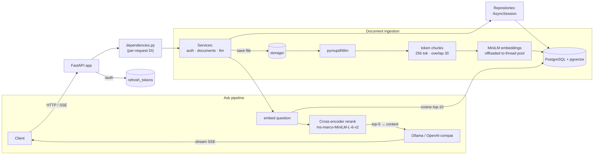

# notebooklm-rag

Self-hosted, NotebookLM-style backend: upload documents, embed them into PostgreSQL
with **pgvector**, and ask questions answered by a **local LLM (Ollama)** — or any
OpenAI-compatible API — with answers **streamed over SSE**.


> Demo GIF in progress — the Quickstart below works today.

---

## Why this project stands out

Most portfolio RAG demos stop at "fastapi + openai call." This one is built around
a few deliberately engineered foundations:

- **Async-native data path** — end-to-end `AsyncSession` (SQLAlchemy 2.0) with all
  blocking CPU work (PDF chunking, transformer embeddings, cross-encoder reranking)
  offloaded via `asyncio.to_thread` so the event loop never freezes during ingestion
  or retrieval.
- **Stateful refresh-token authentication** — short-lived access tokens (30 min) plus
  14-day refresh tokens that are **single-use and rotate on every refresh**, stored
  only as SHA-256 hashes with full revocation (logout, password change, account delete).
- **Deliberate request-vs-process lifetime design** — a `dependencies.py` provider
  layer where anything touching a request-scoped DB session is rebuilt per request,
  while heavyweight, request-agnostic singletons (torch models, HTTP clients) live
  exactly once per process.
- **Alembic-managed schema** — a single verified baseline migration; `alembic upgrade
  head` is the only way tables come to exist (verified by periodically regenerating
  the whole DB from scratch).
- **Pluggable LLM backend per request** — `"provider": "local"` (Ollama) or
  `"provider": "api"` (any OpenAI-compatible API) chosen per question via
  configuration, no code changes.

## Architecture



## Quickstart

Requirements: Docker + Docker Compose. Nothing else — the app, database, vector
store, and LLM all come up as one stack.

```bash
git clone <repo-url> && cd notebooklm-rag
cp .env.example .env   # then edit the placeholders below
docker compose up --build
```

Minimal `.env` (see full table below):

```bash
POSTGRES_USER=admin
POSTGRES_PASSWORD=change-me
SECRET_KEY=$(openssl rand -hex 32)
```

⚠️ **First boot downloads models** — Ollama pulls `llama3.2:1b` (~1.3 GB) and the
Hugging Face embedding + reranker models are cached (~0.5 GB). Expect a few minutes
on cold start; every subsequent `up` starts instantly from named volumes.

Then, the whole story in four calls:

```bash
# register
curl -X POST localhost:8000/auth/register \
  -H 'Content-Type: application/json' \
  -d '{"username":"demo","email":"demo@x.dev","password":"Test123!"}'

# login → get access + refresh pair
curl -X POST localhost:8000/auth/login \
  -d 'username=demo&password=Test123!'

# upload a document
curl -X POST localhost:8000/documents/upload_document \
  -H "Authorization: Bearer <ACCESS_TOKEN>" \
  -F "uploaded_file=@paper.pdf"

# ask the RAG
curl -N -X POST localhost:8000/llm/ask_question \
  -H "Authorization: Bearer <ACCESS_TOKEN>" \
  -H 'Content-Type: application/json' \
  -d '{"question":"What does the paper say about X?","provider":"local"}'
```

Interactive API exploration: <http://localhost:8000/docs>

## Authentication model

Two tokens, two lifetimes, deliberately asymmetric:

| Token | Lifetime | Storage / properties |
|---|---|---|
| `access_token` | 30 min | Standard HS256 JWT, every request's `Authorization: Bearer` |
| `refresh_token` | 14 days | Issued only at login, **single-use**: every refresh mints a new pair and revokes the old; DB stores only its SHA-256 hash plus a validity flag |

Rotation happens server-side in one atomic path: decode → type-check → hash-lookup →
revoke old → reissue pair. Logout revokes. Changing the password revokes **all** of a
user's refresh tokens. `DELETE /user/delete_user` requires the account password and
cascades both DB rows/documents/vectors **and** the user's files on disk.

## The RAG pipeline (one upload to answer)

1. **Parse** – `pymupdf4llm` converts PDFs to markdown page chunks (text or docx
   support is on the roadmap).
2. **Chunk** – each page is tokenized and split into 256-token chunks with 30-token
   overlap, tracking page ranges for provenance.
3. **Embed** – `sentence-transformers/all-MiniLM-L6-v2` vectors (384-dim), computed
   in a thread pool, written to `vector_table` (pgvector).
4. **Retrieve** – question embedded with the same model; **cosine-similarity top-10**
    scoped to the requesting user.
5. **Rerank** – `cross-encoder/ms-marco-MiniLM-L-6-v2` rescores candidates and keeps
   the top-5 as prompt context.
6. **Answer** – a local `llama3.2:1b` (via Ollama) or any OpenAI-compatible API
   responds, streamed over `text/event-stream`.

## API surface

| Method | Route | Purpose |
|---|---|---|
| `POST` | `/auth/register` | create account (username/email/password) |
| `POST` | `/auth/login` | OAuth2 form login → access + refresh pair |
| `POST` | `/auth/refresh` | rotate refresh token, get a fresh pair |
| `POST` | `/auth/logout` | revoke a refresh token |
| `GET` | `/user/me` | current user profile (whitelist of 5 fields) |
| `POST` | `/user/change_username` | password-verified rename |
| `POST` | `/user/change_password` | rotates all sessions |
| `DELETE` | `/user/delete_user` | password-verified account deletion incl. files |
| `POST` | `/documents/upload_document` | store + chunk + embed a PDF |
| `POST` | `/documents/delete_document` | remove document, its chunks, its file |
| `POST` | `/llm/ask_question` | RAG answer, streamed (provider: `local`/`api`) |

## Configuration

Environment is loaded via `pydantic-settings` from `.env`; the same keys drive
docker-compose (with `POSTGRES_HOST=db`, `LLM_LOCAL_BASE_URL=http://ollama:11434/v1`,
`STORAGE=/app/storage` overridden at the service level).

| Variable | Purpose / default |
|---|---|
| `POSTGRES_USER`, `POSTGRES_PASSWORD` | DB credentials (required) |
| `POSTGRES_HOST`, `POSTGRES_PORT`, `POSTGRES_DB` | `localhost`, `5432`, `notebook` |
| `SECRET_KEY`, `ALGO` | JWT signing (`HS256`) |
| `LLM_LOCAL_BASE_URL`, `LLM_LOCAL_MODEL` | `http://localhost:11434/v1`, `llama3.2:1b` |
| `LLM_API_KEY`, `LLM_API_MODEL`, `LLM_API_BASE_URL` | OpenAI-compatible provider (empty = disabled) |
| `STORAGE` | upload directory (default: project `storage/`) |

## Development status

- **Lint**: `ruff check` green-configured (CI workflow in `.github/workflows/`).
- **Type checks**: `mypy` config in `pyproject.toml`; workflow active, strictness
  growing incrementally (see TODO `#14`).
- **Tests**: `tests/` suite starting now; CI job with a postgres service container
  follows in the same wave.
- **Docker**: `compose`-based full stack with healthcheck-gated startup, named volumes
  for models and uploads, and an alembic-first entrypoint.

Living backlog, with engineering notes on everything above: [`TODO.md`](TODO.md).

## Roadmap

- **Grounded citations** — stream page-level sources (`page_start`/`page_end`
  already stored per chunk) alongside answers; LLM cites `[1]`.
- **Background ingestion** — return `202 Accepted`, process uploads via
  `BackgroundTasks`, surface a `documents.status` column.
- **Notebooks** — group sources into notebooks and scope Q&A per notebook.
- **Per-source summaries** — one-click doc TL;DR on upload (the NotebookLM "Source
  Guide" touch).
- **Retrieval depth** — batch embedding upload path, hybrid keyword+vector search,
  multi-query retrieval.
- **Observability** — `/health` live/ready probes, structured request logging with
  request IDs, metrics endpoint.
- **Quality hardening** — full `pytest` suite + coverage, mypy green, docker build CI.
