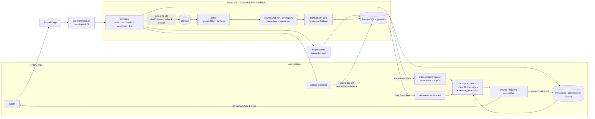

# notebooklm-rag

Self-hosted, NotebookLM-style backend: upload documents, embed them into PostgreSQL
with **pgvector**, and ask questions answered by a **local LLM (Ollama)** — or any
OpenAI-compatible API — with answers **streamed over SSE**.

---

## Project features

- **Async-native data path** — end-to-end `AsyncSession` (via SQLAlchemy), all 
  CPU-heavy work (PDF chunking, transformer embeddings, cross-encoder reranking)
  is offloaded via `asyncio.to_thread`.
- **Stateful refresh-token authentication** — 30-minute access JWTs plus 14-day
  refresh tokens. Refresh tokens are **single-use**: every RT rotation revokes the old
  token and mints a fresh pair, only RT SHA-256 hashes are stored, and expiry is enforced
  at both **the database level** and JWT decoding level. Logout triggers a token expiry and 
  a password change revokes all of a user's refresh tokens at once.
- **Notebooks** — documents group into user-unique notebooks
  (`UNIQUE (owner, name)`). The API allows only one unique document per notebook: the
  same file may exist in two different notebooks, duplicate documents aren't allowed (results in `422`) — 
  and every upload, retrieval and question is tied to exactly one notebook by name.
- **Conversation memory** — every exchange is persisted in database in a per-notebook
  `messages` table; only the last 10 turns (5 questions and 5 responses 
  due to 8k context window of LLama model) are injected into each prompt, so follow-up 
  questions can depend on history.
- **Deliberate request-vs-process lifetime design** — a `dependencies.py` provider
  layer where anything touching a request-scoped DB session is rebuilt per request.
  Expensive dependency loading (torch models, HTTP clients) is done once at the start of 
  backend and persists until backend is terminated.
- **Alembic-managed schema** — tables come to exist exclusively via
  `alembic upgrade head` (baseline + notebooks/messages revision); the container
  entrypoint runs migrations before start.
- **Pluggable LLM backend per request** — `"provider": "local"` (Ollama) or
  `"provider": "api"` (any OpenAI-compatible API), chosen per question via
  configuration, no code changes.
- **Basic logging** — structured JSON application logs with a per-request
  `request_id`, HTTP method/path/status and service-level call messages.
- **Enforced validation of some requests** — username ≤ 30 characters, real email format
  (`EmailStr`), uploads capped at 20 MB, empty files rejected.

## Architecture


```mermaid
flowchart LR
    Client -->|"HTTP · SSE"| API["FastAPI app"]
    API --> DI["dependencies.py<br/>per-request DI"]
    DI --> SVC["Services:<br/>auth · documents · notebook · llm"]
    SVC --> REPO["Repositories<br/>AsyncSession"]
    REPO --> PG[("PostgreSQL + pgvector")]
    SVC --> MSG[("messages · conversation history")]

    subgraph ING["Ingestion — scoped to one notebook"]
      direction TB
      SVC -->|"size ≤ 20 MB<br/>sha256 per-notebook dedup"| FS[("storage/")]
      FS --> PAR["parse<br/>pymupdf4llm · txt lines"]
      PAR --> CH["chunks 256 tok · overlap 30<br/>page/line provenance"]
      CH --> EMB["MiniLM 384-dim<br/>thread-pool offload"]
      EMB --> PG
    end

    subgraph ASK["Ask pipeline"]
      direction TB
      SVC --> QE["embed question"]
      QE -->|"cosine top-20<br/>scoped by notebook"| PG
      PG -->|"more than 5 hits"| RR["cross-encoder rerank<br/>ms-marco → top-5"]
      PG -->|"5 or fewer hits"| CO["distance &lt; 0.5 cut-off"]
      RR --> PR["prompt = context<br/>+ last 10 messages<br/>+ honesty instruction"]
      CO --> PR
      MSG --> PR
      PR --> LM["Ollama / OpenAI-compatible"]
      LM -->|"streamed data: frames"| Client
      LM -->|"persist both turns"| MSG
    end
```

## Quickstart

Requirements: Docker + Docker Compose and an `.env` file.

```bash
git clone <repo-url> && cd notebooklm-rag
cp .env.example .env   # then edit the placeholders below
docker compose up --build
```

Minimal `.env` (full table below):

```bash
POSTGRES_USER=admin
POSTGRES_PASSWORD=   # e.g. $(openssl rand -base64 20)
SECRET_KEY=          # e.g. $(openssl rand -hex 32)
```

The stack is three services: **db** (Postgres with the pgvector extension),
**ollama** (pulls the configured model), and **app** (FastAPI). The app container's
entrypoint first runs `alembic upgrade head` against the database and only then
starts uvicorn, so the schema is always in sync — and via healthchecks it waits for
both dependencies before booting.

⚠️ **First boot downloads all required models** — Ollama pulls `llama3.2:1b` (~1.3 GB)
and the Hugging Face embedding + reranker models are cached (~0.5 GB). Expect a few
minutes of cold start; every later `up` starts instantly from named volumes.

An interactive API explorer is available out of the box at
<http://localhost:8000/docs>.

## Usage walkthrough

```bash
# 1) register — username ≤ 30 chars, valid email required
curl -X POST localhost:8000/auth/register \
  -H 'Content-Type: application/json' \
  -d '{"username":"demo","email":"demo@x.dev","password":"Test123!"}'

# 2) login (form-encoded) → {"access_token": "...", "refresh_token": "..."}
curl -X POST localhost:8000/auth/login \
  -d 'username=demo&password=Test123!'

TOK='<ACCESS_TOKEN>'

# 3) create a notebook — everything hangs off a notebook name
curl -X POST localhost:8000/notebooks/create_notebook \
  -H "Authorization: Bearer $TOK" \
  -H 'Content-Type: application/json' \
  -d '{"notebook_name":"research"}'

# 4) upload a document INTO the notebook (multipart form)
curl -X POST localhost:8000/documents/upload_document \
  -H "Authorization: Bearer $TOK" \
  -F "uploaded_file=@paper.pdf" \
  -F "notebook_name=research"

# 5) ask a question — scoped to one notebook, streamed as SSE "data:" frames
curl -N -X POST localhost:8000/llm/ask_question \
  -H "Authorization: Bearer $TOK" \
  -H 'Content-Type: application/json' \
  -d '{"question":"What does the paper say about X?","provider":"local","notebook_name":"research"}'

# a follow-up question in the same notebook sees the previous turns as context

# 6) browse what exists
curl localhost:8000/notebooks/get_all_notebooks \
  -H "Authorization: Bearer $TOK"

curl -G localhost:8000/documents/get_documents_by_notebook \
  --data-urlencode 'notebook_name=research' \
  -H "Authorization: Bearer $TOK"

# 7) refresh rotation — ALWAYS store the new pair; the old refresh token is revoked
curl -X POST localhost:8000/auth/refresh \
  -H 'Content-Type: application/json' \
  -d '{"refresh_token":"<REFRESH_TOKEN>"}'

# 8) remove a document from a notebook (JSON body)
curl -X DELETE localhost:8000/documents/delete_document \
  -H "Authorization: Bearer $TOK" \
  -H 'Content-Type: application/json' \
  -d '{"document_id":1,"notebook_name":"research"}'

# 9) logout — permanently revokes that refresh token
curl -X POST localhost:8000/auth/logout \
  -H 'Content-Type: application/json' \
  -d '{"refresh_token":"<REFRESH_TOKEN>"}'

# 10) delete a notebook (cascades its documents, files and messages) …
curl -X DELETE localhost:8000/notebooks/delete_notebook \
  -H "Authorization: Bearer $TOK" \
  -H 'Content-Type: application/json' \
  -d '{"notebook_name":"research"}'

# … and/or the whole account (password-verified, cascades everything)
curl -X DELETE localhost:8000/user/delete_user \
  -H "Authorization: Bearer $TOK" \
  -H 'Content-Type: application/json' \
  -d '{"password":"Test123!"}'
```

## Authentication model

| Token | Lifetime | Storage / properties |
|---|---|---|
| `access_token` | 30 min | HS256 JWT sent as `Authorization: Bearer` on every request; stateless, not tracked in the database. |
| `refresh_token` | 14 days | Issued at login only; **single-use** — every refresh revokes the old token and returns a fresh pair; SHA-256 hashes are stored and expiration is checked against database |

Rotation happens server-side in one pass: decode → type check → hash lookup (with
expiry) → revoke old → reissue pair. Logout revokes. Changing the password revokes
**all** of a user's refresh tokens. Registration validates username length
(≤ 30 chars) and real email format; `DELETE /user/delete_user` requires the account
password and cascades every row, vector entry and file on disk.

## The RAG pipeline

0. **Intake gate** — the target notebook must exist; the file must be non-empty and
   ≤ 20 MB, its extension must be supported (`pdf`, `txt` — `md` is treated as plain
   text), and its SHA-256 hash must not already exist **in that notebook** (`422`).
1. **Parse** — `pymupdf4llm` converts PDFs to markdown per page; text files are read
   line by line.
2. **Chunk** — content is tokenized into 256-token chunks with 30-token overlap,
   tracking page/line ranges for provenance. Chunkers are naive and do
   not respect sentence semantics.
3. **Embed** — `sentence-transformers/all-MiniLM-L6-v2` vectors (384-dim), computed in
   a thread pool, written to the pgvector table.
4. **Retrieve (notebook-scoped)** — the question is embedded with the same model and
   matched by cosine distance **within the chosen notebook only**, top-20.
   * More than 5 hits → **cross-encoder rerank** (`ms-marco-MiniLM-L-6-v2`) → top-5.
   * 5 or fewer hits → keep only chunks with **distance &lt; 0.5**.
5. **Assemble** — prompt = retained context + the notebook's **last 10 messages** +
   an honesty instruction: if the context doesn't cover the question, the model is
   instructed to say so rather than hallucinate (if everything was filtered out, the
   prompt states there is not enough information).
6. **Answer** — `llama3.2:1b` via Ollama (or any configured OpenAI-compatible API)
   streams the reply over `text/event-stream` as `data:` frames; both the user's
   question and the assistant's reply are persisted to `messages` after the stream
   completes.

## Methods implemented in the API

| Method | Route | Purpose | Payload |
|---|---|---|---|
| `GET` | `/` | liveness probe (`{"message": "API is running"}`) | — |
| `POST` | `/auth/register` | create account | JSON `{username, email, password}` |
| `POST` | `/auth/login` | OAuth2 form login → token pair | form `username`, `password` |
| `POST` | `/auth/refresh` | rotate refresh token → fresh pair | JSON `{refresh_token}` |
| `POST` | `/auth/logout` | revoke a refresh token | JSON `{refresh_token}` |
| `GET` | `/user/me` | current user profile (5 public fields) | Bearer |
| `POST` | `/user/change_username` | password-verified rename | JSON `{new_username, password}` |
| `POST` | `/user/change_password` | rotates all sessions | JSON `{old_password, new_password}` |
| `DELETE` | `/user/delete_user` | password-verified account deletion incl. files | JSON `{password}` |
| `POST` | `/notebooks/create_notebook` | create a notebook | JSON `{notebook_name}` |
| `GET` | `/notebooks/get_all_notebooks` | list owned notebooks | Bearer |
| `DELETE` | `/notebooks/delete_notebook` | delete notebook + cascade | JSON `{notebook_name}` |
| `POST` | `/documents/upload_document` | store + chunk + embed | multipart `uploaded_file`, `notebook_name` |
| `GET` | `/documents/get_documents_by_notebook` | list a notebook's documents | query `notebook_name` |
| `DELETE` | `/documents/delete_document` | remove document, its chunks, its file | JSON `{document_id, notebook_name}` |
| `POST` | `/llm/ask_question` | RAG answer, streamed | JSON `{question, provider, notebook_name}` |

All methods but `/auth/` methods require `Authorization: Bearer <access_token>`.
`/llm/ask_question` answers with `text/event-stream` so the response gets printed word by word.

## Configuration

Environment is loaded via `pydantic-settings` from `.env`; the same keys drive
docker-compose (with `POSTGRES_HOST=db`, `POSTGRES_PORT=5432`,
`LLM_LOCAL_BASE_URL=http://ollama:11434/v1` and `STORAGE=/app/storage` overridden at
the service level).

| Variable | Purpose / default |
|---|---|
| `POSTGRES_USER`, `POSTGRES_PASSWORD` | DB credentials (required) |
| `POSTGRES_HOST`, `POSTGRES_PORT`, `POSTGRES_DB` | `localhost`, `5432`, `notebook` |
| `SECRET_KEY`, `ALGO` | JWT signing (`HS256`) |
| `LLM_LOCAL_BASE_URL`, `LLM_LOCAL_MODEL` | `http://localhost:11434/v1`, `llama3.2:1b` |
| `LLM_API_KEY`, `LLM_API_MODEL`, `LLM_API_BASE_URL` | OpenAI-compatible provider (empty = disabled) |
| `STORAGE` | upload directory (default: project `storage/`) |

## Development status

- **Lint** — `ruff check` green, enforced by CI workflow.
- **Types** — `mypy` workflow active (currently targeting `main.py`), with repo-wide
  typing growing over time.
- **Tests** — `pytest` suite (12 tests) covering the full authentication surface:
  registration incl. duplicates, good/bad logins, profile, username/password changes
  and the root probe, exercised through the real HTTP stack against a live Postgres.
- **Schema** — alembic-managed, baseline plus the notebooks/messages revision; the
  database can be wiped and regenerated from migrations alone.
- **Docker** — compose stack with healthcheck-gated startup, named volumes for models
  and uploads, and a migration-first entrypoint.

## Known limitations

- **Naive chunking** — fixed token windows while ignoring sentence semantics.
- **Soft abstention only** — a distance threshold plus a prompt instruction; there is
  no hard "refuse to answer" cut-off yet.
- **`docx` is not supported** — deliberately dropped from the allow-list until it is
  implemented properly (unsupported types get a clean `415`).
- **Naive timestamps** — `DateTime` columns carry no timezone info.
- **Sequential-scan retrieval** — no ANN index on the embedding column yet (fine at
  demo-scale row counts).
- **Test coverage gaps** — upload → embed, ask, delete and notebook flows are not yet
  covered by the automated suite.

## Roadmap

- **Grounded citations** — chunk-level page provenance is already stored; stream a
  `sources` event before tokens and let the model cite `[1]`.
- **Hard abstention** — refuse above a tuned cosine cutoff instead of trusting the
  prompt.
- **Background ingestion** — `202 Accepted` + background processing with a
  `documents.status` column.
- **Batch embedding** — encode all chunks of a document in one batched call
  (significant upload speed-up).
- **Hybrid search** — Postgres `tsvector` keyword search fused with pgvector results.
- **ANN index** — pgvector HNSW index once row counts justify it.
- **Per-source summaries** — one LLM call after embedding, stored per document.
- **Broader test coverage** — isolated test database, then upload/ask/delete flows.
- **A dedicated web frontend** is in development.

---

*This README describes the backend only. It was generated by AI (Kimi-K3) and checked by the
repo maintainer.*
